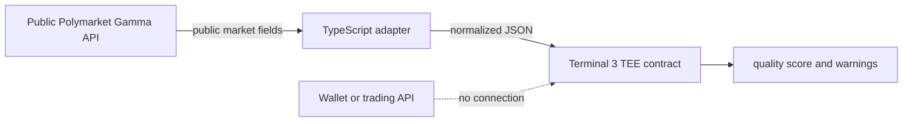

# T3N Polymarket Sentinel

[](https://github.com/jiahao6635/t3n-polymarket-sentinel/actions/workflows/ci.yml)

A read-only Rust/WASM contract for Terminal 3 that screens public Polymarket data for liquidity, spread, price consistency, and activity risk.

This project is a submission for the [Terminal3 Agent ID + first Rust contract bounty](https://superteam.fun/earn/listing/ai-id/). It adds a practical prediction-market use case while keeping the contract deliberately unable to trade or access funds.

## Safety boundary

The contract imports no Terminal 3 host capabilities. It cannot:

- access a wallet or private key;
- sign or submit an order;
- deposit, withdraw, or move funds;
- call an external network;
- read secrets or persistent storage.

The TypeScript adapter fetches public data from Polymarket's Gamma API, normalizes six non-sensitive fields, and sends them to the contract for deterministic analysis. The output is data-quality screening, not a price forecast or trading recommendation.

## What the contract returns

`analyze-market` validates the payload and returns:

- normalized outcome probabilities;
- the dominant outcome and normalized probability;
- spread and price-sum deviation in basis points;
- liquidity tier and 24-hour activity ratio;
- a deterministic quality score from 0 to 100;
- explicit warnings for thin liquidity, low activity, wide spreads, or inconsistent prices.

## Architecture



## Build and test the Rust contract

Requirements: Rust stable and the `wasm32-wasip2` target.

```bash
rustup target add wasm32-wasip2
cargo test --lib
cargo clippy --all-targets -- -D warnings
cargo build --target wasm32-wasip2 --release
```

The WASM component is generated at:

```text
target/wasm32-wasip2/release/z_polymarket_sentinel.wasm
```

Optional interface verification:

```bash
wasm-tools component wit target/wasm32-wasip2/release/z_polymarket_sentinel.wasm
```

## Connect, register, and invoke on Terminal 3 testnet

The Terminal 3 claim page shows the API key only once. Keep it in a local ignored file or shell environment; never paste it into a repository, issue, screenshot, or submission document.

```bash
cd app
npm install

# Load T3N_API_KEY into the current shell without printing it.
npm run connect
npm run register
npm run invoke -- <polymarket-market-slug>
```

For a fresh tenant, `npm run all -- <slug>` performs registration and one invocation in a single run. Registration versions are immutable, so do not rerun `register` with the same version.

## Example input

```json
{
  "question": "Will the sample event resolve Yes?",
  "outcomes": ["Yes", "No"],
  "prices": [0.42, 0.58],
  "liquidity_usd": 125000,
  "volume_24h_usd": 18000,
  "spread": 0.006
}
```

## Repository layout

```text
src/                 Rust contract and unit tests
wit/world.wit        exported Terminal 3 contract interface
app/quickstart.ts    connect, register, fetch public market data, invoke
fixtures/            safe sample input
docs/                bounty submission report and evidence
```

## License

MIT
